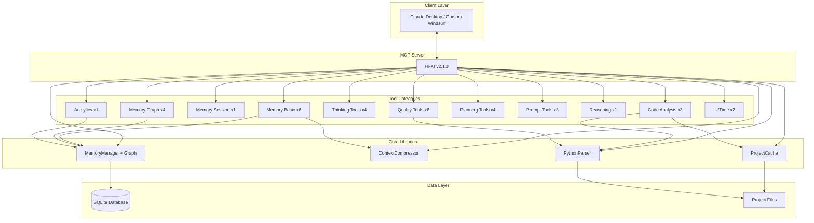

# Hi-AI

<div align="center">

[](https://smithery.ai/server/@su-record/hi-ai)
[](https://www.npmjs.com/package/@su-record/hi-ai)
[](https://opensource.org/licenses/MIT)
[](https://modelcontextprotocol.io)
[](https://github.com/su-record/hi-ai)
[](https://github.com/su-record/hi-ai)

**Model Context Protocol Based AI Development Assistant**

TypeScript + Python Support · 35 Specialized Tools · Knowledge Graph Memory · Session Context Auto-Injection

<a href="https://glama.ai/mcp/servers/@su-record/hi-ai">
  
</a>

[한국어](README.ko.md)

</div>

---

## Table of Contents

- [Overview](#overview)
- [Key Features](#key-features)
- [v2.1.0 Updates](#v210-updates)
- [Installation](#installation)
- [Tool Catalog](#tool-catalog)
- [Architecture](#architecture)
- [Performance](#performance)
- [Development Guide](#development-guide)
- [License](#license)

---

## Overview

Hi-AI is an AI development assistant that implements the **Model Context Protocol (MCP)** standard. It provides 35 specialized tools through natural language keyword recognition, helping developers perform complex tasks intuitively.

### Core Values

- **Natural Language Based**: Automatically executes tools with Korean/English keywords
- **Knowledge Graph Memory**: Organizes memory relationships into a graph for exploring related information
- **Multi-Language Support**: TypeScript, JavaScript, Python code analysis
- **Dependency Analysis**: Visualizes code dependencies and detects circular references
- **Enterprise Quality**: 100% test coverage and strict type system

---

## Key Features

### 1. Knowledge Graph Memory System

11 tools for organizing memory relationships into a graph for exploring related information:

- **Session Context Auto-Injection**: Automatically loads previous memories and knowledge graph on session start (v2.1 NEW)
- **Relationship Linking**: Sets semantic relationships between memories (related_to, depends_on, implements, etc.)
- **Graph Traversal**: Related memory exploration through BFS/DFS algorithms
- **Multi-Strategy Search**: Supports 5 search strategies (keyword, graph_traversal, temporal, priority, context_aware)
- **Timeline**: Time-ordered memory history visualization

**Key Tools:**
- `get_session_context` - 🚀 Auto-load context on session start (v2.1 NEW)
- `save_memory` - Store information in long-term memory
- `recall_memory` - Search stored information
- `link_memories` - Link relationships between memories
- `get_memory_graph` - Query knowledge graph
- `search_memories_advanced` - Multi-strategy search
- `create_memory_timeline` - Create timeline
- `prioritize_memory` - Manage memory priority

### 2. Semantic Code Analysis

AST-based code analysis and exploration tools:

- **Symbol Search**: Locate functions, classes, variables across the project
- **Reference Tracking**: Track all usages of specific symbols
- **Dependency Graph**: Code dependency visualization (v2.0 NEW)
- **Circular Reference Detection**: Automatic circular dependency detection (v2.0 NEW)
- **Multi-Language**: TypeScript, JavaScript, Python support

**Key Tools:**
- `find_symbol` - Search symbol definitions
- `find_references` - Find symbol references
- `analyze_dependency_graph` - Dependency graph analysis (v2.0 NEW)

### 3. Code Quality Analysis

Comprehensive code metrics and quality evaluation:

- **Complexity Analysis**: Cyclomatic, Cognitive, Halstead metrics
- **Coupling/Cohesion**: Module structure health evaluation
- **Quality Score**: A-F grading system
- **Improvement Suggestions**: Actionable refactoring recommendations

**Key Tools:**
- `analyze_complexity` - Complexity metrics analysis
- `validate_code_quality` - Code quality evaluation
- `check_coupling_cohesion` - Coupling/cohesion analysis
- `suggest_improvements` - Improvement suggestions
- `apply_quality_rules` - Apply quality rules
- `get_coding_guide` - Get coding guide

### 4. Project Planning Tools

Systematic requirements analysis and roadmap generation:

- **PRD Generation**: Automatic Product Requirements Document creation
- **User Stories**: Stories with acceptance criteria
- **MoSCoW Analysis**: Requirements prioritization
- **Roadmap Creation**: Phased development schedule planning

**Key Tools:**
- `generate_prd` - Generate Product Requirements Document
- `create_user_stories` - Create user stories
- `analyze_requirements` - Requirements analysis
- `feature_roadmap` - Feature roadmap generation

### 5. Sequential Thinking Tools

Structured problem solving and decision support:

- **Problem Decomposition**: Break down complex problems step by step
- **Thinking Chain**: Create sequential reasoning process
- **Multiple Perspectives**: Analytical/creative/systematic/critical thinking
- **Execution Plan**: Convert tasks into actionable plans

**Key Tools:**
- `create_thinking_chain` - Create thinking chain
- `analyze_problem` - Problem analysis
- `step_by_step_analysis` - Step-by-step analysis
- `format_as_plan` - Format as plan

### 6. Prompt Engineering

Prompt quality enhancement and optimization:

- **Auto Enhancement**: Convert vague requests into specific ones
- **Quality Scoring**: Clarity, specificity, context scoring
- **Gemini Optimization**: Google Gemini API prompting strategies

**Key Tools:**
- `enhance_prompt` - Enhance prompt
- `analyze_prompt` - Prompt quality analysis
- `enhance_prompt_gemini` - Gemini prompting strategies

### 7. Reasoning Framework

Systematic analysis of complex problems:

- **9-Step Reasoning**: Problem decomposition, hypothesis exploration, risk assessment
- **Logical Validation**: Ensure completeness and precision

**Key Tools:**
- `apply_reasoning_framework` - 9-step reasoning framework

### 8. Usage Analytics (v2.0 NEW)

Tool usage statistics and analysis:

- **Memory Statistics**: Category distribution, time-based activity
- **Graph Analysis**: Connection statistics, cluster information

**Key Tools:**
- `get_usage_analytics` - Usage analytics query

### 9. UI Preview & Time

- `preview_ui_ascii` - ASCII UI preview
- `get_current_time` - Get current time

---

## Hi-GCloud Integration

Hi-AI provides a powerful GCP operations + code modification workflow when used with [hi-gcloud](https://github.com/su-record/hi-gcloud) MCP.

### Integration Method

When hi-gcloud detects errors, it automatically recommends hi-ai tools:

```
📋 Cloud Run logs: my-api
🔴 3 errors detected.

💡 hi-ai integration available: Use analyze_problem tool to analyze the cause,
   find_symbol to locate related code, and suggest_improvements for fixes.
```

### Workflow Example

```
User: "Deployment failed"

[hi-gcloud]
→ Query error logs with gcp_run_logs
→ Found 3 errors, provide hi-ai integration hint

[hi-ai auto-integration]
→ Analyze error cause with analyze_problem
→ Locate related code with find_symbol
→ Propose fixes with suggest_improvements
→ Save solution with save_memory (prevent recurrence)
```

### Installation

Installing both MCPs together enables automatic integration:

```json
{
  "mcpServers": {
    "hi-ai": {
      "command": "npx",
      "args": ["-y", "@su-record/hi-ai"]
    },
    "hi-gcloud": {
      "command": "npx",
      "args": ["-y", "@polin-go/hi-gcloud"]
    }
  }
}
```

### Integration Tool Mapping

| hi-gcloud Situation | hi-ai Recommended Tools |
|---------------------|------------------------|
| Error log detected | `analyze_problem`, `find_symbol` |
| Deployment failed | `step_by_step_analysis`, `suggest_improvements` |
| Performance issue | `analyze_complexity`, `check_coupling_cohesion` |
| Cost increase | `format_as_plan` |

---

## v2.1.0 Updates

### Major Changes

Hi-AI v2.1.0 is a minor release introducing **Session Context Auto-Injection** functionality.

### New Features

| Feature | Description |
|---------|-------------|
| `get_session_context` tool | Query previous memories, knowledge graph, and timeline at once on session start |
| `hi-ai://context/session` resource | Automatically provides context when client reads the resource |
| Tool description improvement | Encourages LLM to automatically understand context on session start |

### Change Summary

| Item | v2.0.0 | v2.1.0 | Change |
|------|--------|--------|--------|
| Tool count | 34 | 35 | +1 |
| Resource count | 3 | 4 | +1 |
| Session context | Manual | Auto recommended | Improved |

---

## v2.0.0 Updates

### Major Changes

Hi-AI v2.0.0 is a major release introducing knowledge graph-based memory system and advanced code analysis features.

### New Features (6 tools)

| Tool | Description |
|------|-------------|
| `link_memories` | Link memory relationships (knowledge graph) |
| `get_memory_graph` | Query/visualize knowledge graph (Mermaid diagram support) |
| `search_memories_advanced` | Multi-strategy search with 5 strategies |
| `create_memory_timeline` | Time-ordered memory timeline |
| `analyze_dependency_graph` | Code dependency analysis and circular reference detection |
| `get_usage_analytics` | Usage statistics/analysis |

### Architecture Improvements

- **index.ts**: 37 switch cases → Dynamic dispatch pattern
- **MemoryManager**: Knowledge graph feature added (395 lines → 823 lines)
- **Code Optimization**: Removed unnecessary dependencies (puppeteer-core)

---

## Installation

### System Requirements

- Node.js 18.0 or higher
- TypeScript 5.0 or higher
- MCP compatible client (Claude Desktop, Cursor, Windsurf)
- Python 3.x (for Python code analysis)

### Installation Methods

#### NPM Package

```bash
# Global install
npm install -g @su-record/hi-ai

# Local install
npm install @su-record/hi-ai
```

#### Smithery Platform

```bash
# One-click install
https://smithery.ai/server/@su-record/hi-ai
```

### MCP Client Configuration

Add to your Claude Desktop or other MCP client's configuration file:

```json
{
  "mcpServers": {
    "hi-ai": {
      "command": "hi-ai",
      "args": [],
      "env": {}
    }
  }
}
```

---

## Tool Catalog

### Complete Tool List (35 tools)

| Category | Count | Tools |
|----------|-------|-------|
| **Memory - Basic** | 6 | save_memory, recall_memory, list_memories, delete_memory, update_memory, prioritize_memory |
| **Memory - Graph** | 4 | link_memories, get_memory_graph, search_memories_advanced, create_memory_timeline |
| **Memory - Session** | 1 | get_session_context 🚀 |
| **Code Analysis** | 3 | find_symbol, find_references, analyze_dependency_graph |
| **Thinking** | 4 | create_thinking_chain, analyze_problem, step_by_step_analysis, format_as_plan |
| **Code Quality** | 6 | analyze_complexity, validate_code_quality, check_coupling_cohesion, suggest_improvements, apply_quality_rules, get_coding_guide |
| **Planning** | 4 | generate_prd, create_user_stories, analyze_requirements, feature_roadmap |
| **Prompt** | 3 | enhance_prompt, analyze_prompt, enhance_prompt_gemini |
| **Reasoning** | 1 | apply_reasoning_framework |
| **Analytics** | 1 | get_usage_analytics |
| **UI** | 1 | preview_ui_ascii |
| **Time** | 1 | get_current_time |

### Keyword Mapping Examples

#### Memory Tools

| Tool | Korean Keywords | English Keywords |
|------|-----------------|------------------|
| save_memory | 기억해, 저장해 | remember, save this |
| recall_memory | 떠올려, 기억나 | recall, remind me |
| get_session_context | 세션 시작, 컨텍스트 | session start, context |
| link_memories | 연결해, 관계 | link, connect |
| get_memory_graph | 그래프, 관계도 | graph, relations |
| search_memories_advanced | 고급 검색, 찾아 | advanced search, find |

#### Code Analysis Tools

| Tool | Korean Keywords | English Keywords |
|------|-----------------|------------------|
| find_symbol | 함수 찾아, 클래스 어디 | find function, where is |
| analyze_dependency_graph | 의존성, 관계 | dependency, relations |
| analyze_complexity | 복잡도, 복잡한지 | complexity, how complex |
| validate_code_quality | 품질, 리뷰 | quality, review |

---

## Architecture

### System Structure



### Core Components

#### MemoryManager (v2.0 extended)
- **Role**: Persistent memory storage and knowledge graph management
- **Technology**: SQLite, better-sqlite3
- **Features**: CRUD, search, priority, graph relationships, BFS/DFS traversal
- **Optimization**: WAL mode, indexing, Prepared Statements

#### ContextCompressor
- **Role**: Context compression management
- **Algorithm**: Priority-based compression
- **Features**: Selective preservation based on importance

#### ProjectCache
- **Role**: ts-morph project caching
- **Strategy**: LRU algorithm
- **Features**: Improved repeated analysis performance
- **Limits**: 100MB/project, 200MB total

#### PythonParser
- **Role**: Python code AST analysis
- **Method**: subprocess execution
- **Features**: Symbol extraction, complexity calculation
- **Safety**: Timeout, automatic cleanup

### Database Schema (v2.0)

```sql
-- memories table
CREATE TABLE memories (
  key TEXT PRIMARY KEY,
  value TEXT NOT NULL,
  category TEXT NOT NULL DEFAULT 'general',
  timestamp TEXT NOT NULL,
  lastAccessed TEXT NOT NULL,
  priority INTEGER DEFAULT 0
);

-- memory_relations table (v2.0 NEW)
CREATE TABLE memory_relations (
  id INTEGER PRIMARY KEY AUTOINCREMENT,
  sourceKey TEXT NOT NULL,
  targetKey TEXT NOT NULL,
  relationType TEXT NOT NULL,
  strength REAL DEFAULT 1.0,
  metadata TEXT,
  timestamp TEXT NOT NULL,
  UNIQUE(sourceKey, targetKey, relationType)
);
```

---

## Performance

### Major Optimizations

#### Project Caching
- Improved repeated analysis performance through LRU cache
- 5-minute TTL to maintain fresh state
- Resource management through memory limits

#### Memory Operations
- SQLite transaction for batch operation optimization
- Time complexity improvement: O(n²) → O(n)
- Fast lookup through indexing

#### Graph Traversal (v2.0)
- Efficient traversal with BFS/DFS algorithms
- Cluster detection with Union-Find
- Path finding optimization

---

## Development Guide

### Environment Setup

```bash
# Clone repository
git clone https://github.com/su-record/hi-ai.git
cd hi-ai

# Install dependencies
npm install

# Build
npm run build

# Development mode
npm run dev
```

### Testing

```bash
# Run all tests
npm test

# Watch mode
npm run test:watch

# UI mode
npm run test:ui

# Coverage report
npm run test:coverage
```

### Code Style

- **TypeScript**: strict mode
- **Types**: Use `src/types/tool.ts`
- **Tests**: Maintain 100% coverage
- **Commits**: Conventional Commits format

### Adding New Tools

1. Create file in `src/tools/category/` directory
2. Implement `ToolDefinition` interface
3. Register in `src/index.ts` `toolHandlers`
4. Write tests in `tests/unit/` directory
5. Update README

---

## Contributors

<a href="https://github.com/su-record/hi-ai/graphs/contributors">
  
</a>

### Special Thanks

- **[Smithery](https://smithery.ai)** - MCP server deployment and one-click installation platform

---

## License

MIT License - Free to use, modify, and distribute

---

## Citation

If using this project for research or commercial purposes:

```bibtex
@software{hi-ai2025,
  author = {Su},
  title = {Hi-AI: Knowledge Graph-Based MCP Server for AI-Assisted Development},
  year = {2025},
  version = {2.1.0},
  url = {https://github.com/su-record/hi-ai}
}
```

---

<div align="center">

## Star History

[](https://star-history.com/#su-record/hi-ai&Date)

<br>

**Hi-AI v2.1.0**

Knowledge Graph Memory · Session Context Auto-Injection · Dependency Analysis · 35 Specialized Tools

Made with ❤️ by [Su](https://github.com/su-record)

<br>

[🏠 Homepage](https://github.com/su-record/hi-ai) ·
[📚 Documentation](https://github.com/su-record/hi-ai#readme) ·
[🐛 Issues](https://github.com/su-record/hi-ai/issues) ·
[💬 Discussions](https://github.com/su-record/hi-ai/discussions)

</div>
